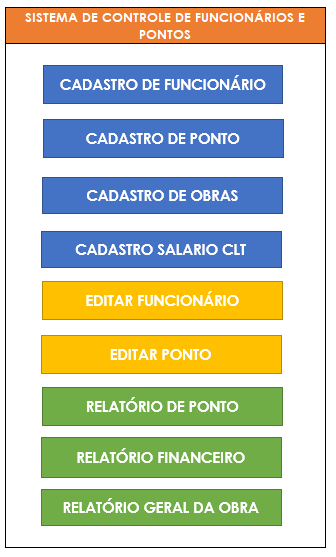
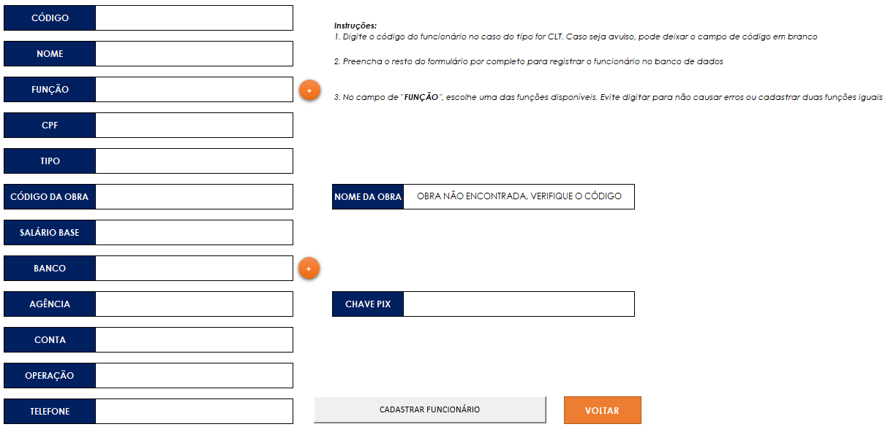
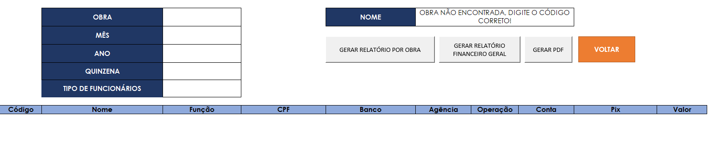

# 📊 Employee Management and Payroll System (Excel + VBA)

A fully automated employee management and payroll tracking system built in Excel with VBA. This solution streamlines the process of registering employees, recording working hours, calculating payrolls, and generating financial reports — all through an intuitive form-based interface.

> 🇧🇷 Versão em português disponível abaixo.

---

## 🚀 Features

- Employee registration with validation for duplicate names and CPF.
- Two contract types: **CLT** and **Freelancer** ("Avulso").
- Attendance logging (single day or date range).
- Automatic salary calculation by **fortnight** (based on actual hours or CLT records).
- Financial reports by worksite and employee type.
- PDF generation for reports and payrolls.
- Worksheet locking with macro-friendly protections.
- Clean, form-driven user interface.
- Fully anonymized and ready for demonstration purposes.

---

## 🛠 Technologies

- **Microsoft Excel** (.xlsm)
- **VBA (Visual Basic for Applications)**

---

### 📷 Screenshots

| Menu | Employee Register | Report |
|------|-------------|-----------|
|  |  |  |

---

## 📁 Folder Structure

📦 cadastro_funcionarios
├── 📄 README.md
├── 📄 LICENSE
├── 📂 docs
    └── 📄 Manual_Usuario_Sistema_Funcionarios.docx
├── 📂 imagens
└── 📂 planilha
    └── CADASTRO_DE_FUNCIONARIOS_MODELO.xlsm

---

## 💡 Use Cases

- Construction companies managing rotating workers per worksite.
- HR departments needing simple, offline payroll control.
- Freelancers or small teams managing field teams and reports.

---

## ⚠️ Disclaimer

This project was developed for educational and portfolio purposes. All data is fictional and the file has been fully anonymized. The original company logo and sensitive fields have been removed.

---

## 📩 Contact

Developed by **Renatho Campos**  
📧 [renathohcc@hotmail.com]  
🔗 [linkedin.com/in/renathohcc](https://linkedin.com/in/renathohcc)

## 🇧🇷 Visão Geral do Projeto

Sistema completo para **cadastro de funcionários e controle de ponto** desenvolvido em Excel com VBA. Permite registrar dados dos funcionários, registrar ponto por formulário, calcular automaticamente os valores por quinzena e gerar relatórios prontos para impressão e PDF.

---

## 🚀 Funcionalidades

- Cadastro de funcionários com verificação de CPF e nome duplicado.
- Suporte a funcionários **CLT** e **Avulsos**.
- Registro de ponto com datas únicas ou intervalos.
- Cálculo automático de salários por **quinzena**, com base no tipo de vínculo.
- Relatórios financeiros por obra e tipo de funcionário.
- Geração de PDF de folhas e relatórios.
- Interface protegida com macros funcionais mesmo com a planilha travada.
- Interface intuitiva com formulários simples.

---

## 🛠 Tecnologias utilizadas

- **Microsoft Excel** (.xlsm)
- **VBA (Visual Basic for Applications)**

---

### 📷 Capturas de tela

| Menu | Cadastro de Funcionário | Relatório |
|------|-------------|-----------|
|  |  |  |

---

## 📦 Estrutura de Pastas

📦 cadastro_funcionarios
├── 📄 README.md
├── 📄 LICENSE
├── 📂 docs
    └── 📄 Manual_Usuario_Sistema_Funcionarios.docx
├── 📂 imagens
└── 📂 planilha
    └── CADASTRO_DE_FUNCIONARIOS_MODELO.xlsm

---

## 💡 Casos de Uso

- Empresas da construção civil com equipes rotativas por obra.
- Pequenas empresas que precisam de um sistema de folha de pagamento simples.
- Autônomos ou equipes reduzidas que atuam em campo e precisam registrar ponto.

---

## ⚠️ Aviso

Este projeto foi desenvolvido para fins educacionais e de portfólio. Todos os dados são fictícios e a planilha foi completamente anonimizada. Logos e dados sensíveis foram removidos.

---

## 🤝 Contribuições

Pull requests e sugestões são bem-vindos! Este repositório é um ponto de partida para automações similares.

---

## 📩 Contato

Desenvolvido por **Renatho Campos**  
📧 [renathohcc@hotmail.com]  
🔗 [linkedin.com/in/renathohcc](https://linkedin.com/in/renathohcc)

---
